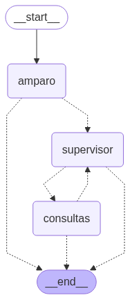

# 🧠 PoC-Amparo — Sistema Multiagente de Atención RRHH

[](https://www.python.org/downloads/)
[](https://python.langgraph.dev/)
[](https://www.langchain.com/)
[](https://fastapi.tiangolo.com/)

**PoC-Amparo** es un sistema de inteligencia artificial basado en agentes, diseñado para asistir a trabajadores de una empresa constructora en temas relacionados con Recursos Humanos (RRHH), como permisos, beneficios, sueldos y documentación.

Este sistema está construido sobre la arquitectura **LangGraph** y utiliza modelos LLM especializados para gestionar flujos de conversación de forma dinámica, escalable y controlada.

---

## 🖼 Vista del grafo de flujo

_A continuación se muestra una imagen del grafo que representa el flujo de nodos entre los agentes:_

> 

---

## ⚙️ Arquitectura General

- **Agente Principal:** `Amparo`  
  Es la asistente virtual que inicia la conversación, saluda al usuario y decide si puede resolver la consulta o si debe escalarla.

- **Supervisor:**  
  Agente orquestador que decide a qué agente especializado delegar la consulta cuando Amparo no puede responder directamente.

- **Agente de Consultas (`consultas`)**  
  Realiza búsqueda semántica en documentos usando embeddings y FAISS, respondiendo preguntas sobre manuales internos (por ejemplo, permisos, horarios, reglamento).

---

## 🗂 Estructura del Proyecto
```
PoC-Amparo/
│
├── api/ # Entrada del sistema (FastAPI u otro)
│ └── main.py # Llama al grafo y gestiona las sesiones
│
├── app/
│ ├── agents/ # Lógica de cada agente (Amparo, retriever, etc.)
│ ├── config/ # Mapas de configuración (LLMs, entorno)
│ ├── graph/ # Definición del grafo de nodos LangGraph
│ ├── persistence/ # Almacenamiento del estado del chat
│ ├── prompts/ # Prompts personalizados por agente
│ ├── tools/ # Herramientas de LangChain (retriever, vectores)
│ └── vectorstore/ # Almacenamiento FAISS del índice de documentos
│
├── assets/ # Imágenes o diagramas del sistema
├── data/ # Archivos fuente, como PDFs o trípticos
├── .env # Variables de entorno
├── requirements.txt # Dependencias del proyecto
└── README.md # Este archivo
```

---

## 🔁 Flujo de Conversación

1. **El usuario inicia el chat.**
2. `Amparo` analiza la intención:
   - Si puede responder, lo hace y finaliza el flujo.
   - Si no, deriva al `supervisor`.
3. El `supervisor` decide:
   - Finalizar el flujo si la respuesta ya se entregó.
   - Derivar al agente `consultas` si se trata de una pregunta documental.
4. `consultas` busca la respuesta en el PDF cargado y la entrega al supervisor.
5. El `supervisor` responde al usuario.
6. Si el usuario queda conforme, el flujo termina.

---

## 📌 Componentes Destacados

| Carpeta / Módulo         | Funcionalidad |
|--------------------------|---------------|
| `agents/`                | Lógica individual de los agentes (Amparo, retriever). |
| `graph/`                 | Armado del flujo LangGraph con nodos y edges. |
| `prompts/`               | Plantillas de prompt específicas por agente. |
| `tools/`                 | Herramientas auxiliares (retrievers, vectores). |
| `vectorstore/`           | Almacenamiento y gestión de FAISS + OpenAIEmbeddings. |
| `persistence/`           | Manejo del checkpoint del estado conversacional. |
| `data/`                  | Manuales o PDFs fuente para los agentes. |

---

## 📄 Documentos Procesados

Actualmente el sistema responde preguntas basadas en el documento:

- `manual_rrhh.pdf`: Contiene políticas internas sobre permisos, beneficios, documentación, etc.

---

## 🎯 Objetivo

Este sistema busca ser un **tótem de autoatención** para trabajadores, ayudándoles a resolver sus consultas frecuentes sin intervención humana, y derivando a especialistas cuando corresponde.
